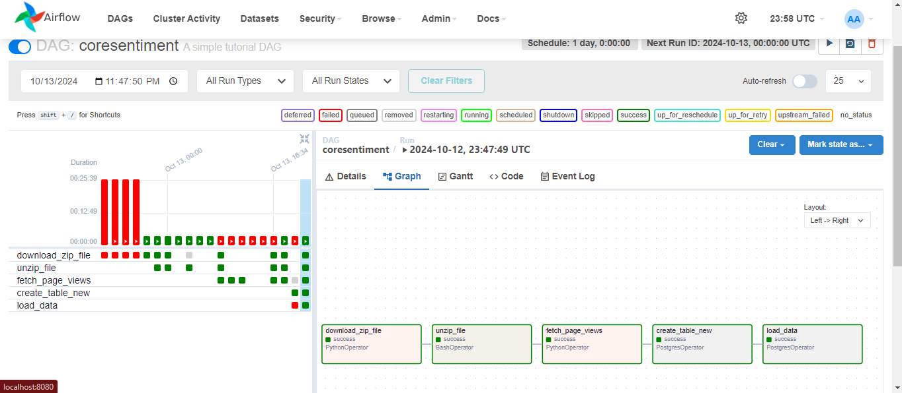

# Data Pipeline Orchestration with Apache Airflow.
 
A data pipeline that addresses data ingestion, processing, storage, and analysis.

This project is build to orchestrate CoreSentiment which is a stock market prediction tool that applies sentiment analysis. The sentiment analysis, leverage the data about the number of Wikipedia page views a company has.

an increase in a company’s website page views shows a positive sentiment, and the company’s stock is likely to increase. On the other hand, a decrease in pageviews tells us a loss in interest, and the stock price is likely to decrease.

## Project Tasks:
This project was created using a DAG pulling the Wikipedia pageview counts by downloading, extracting, and reading the pageview data for 4pm data for 10th of October, 2024. five companies (Amazon, Apple, Facebook, Google, and Microsoft) were selected from the data extracted in order to initially track and validate the hypothesis.

## How to run

1. start your Docker desktop
2. clone and run `docker-compose up -d` to start the application

Final view of the DAG

